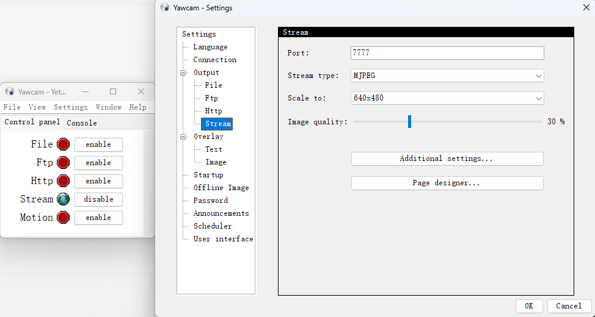
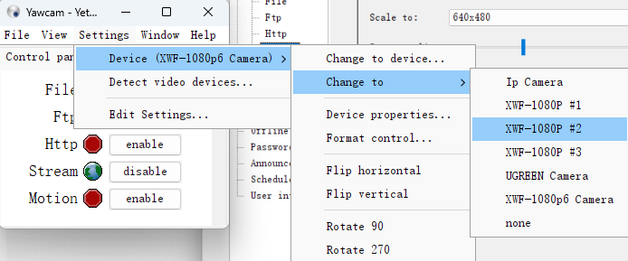
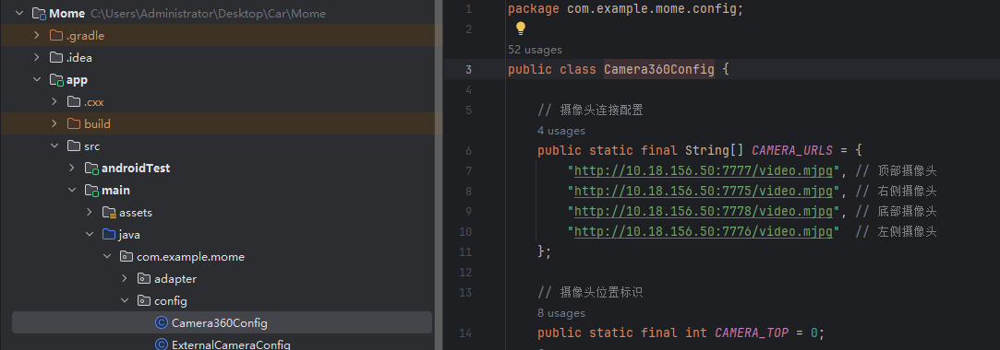

# 全景智行车载辅助系统- 项目部署说明文档

**文档版本**: v1.0
**创建日期**: 2025年7月
**更新日期**: 2025年7月

---

## 目录

1. [部署概述](#1-部署概述)
2. [环境要求](#2-环境要求)
3. [开发环境搭建](#3-开发环境搭建)
4. [项目构建](#4-项目构建)
5. [配置管理](#5-配置管理)
6. [打包发布](#6-打包发布)
7. [部署验证](#7-部署验证)
8. [监控与维护](#8-监控与维护)
9. [故障排除](#9-故障排除)
10. [附录](#10-附录)

---

## 1. 部署概述

### 1.1 项目架构

全景智行车载辅助系统采用以下技术架构：

```
┌─────────────────────────────────────────────────────────────┐
│                    Android应用层                              │
├─────────────────────────────────────────────────────────────┤
│                    Java/Kotlin业务逻辑                        │
├─────────────────────────────────────────────────────────────┤
│                    JNI/NDK本地代码层                          │
├─────────────────────────────────────────────────────────────┤
│                    OpenCV/NCNN库                             │
├─────────────────────────────────────────────────────────────┤
│                    Android系统API                            │
└─────────────────────────────────────────────────────────────┘
```

### 1.2 部署类型

- **开发环境部署**: 用于日常开发和调试
- **测试环境部署**: 用于功能测试和集成测试
- **生产环境部署**: 用于最终用户使用

### 1.3 部署流程

1. 环境准备
2. 源码获取
3. 依赖安装
4. 项目配置
5. 编译构建
6. 测试验证
7. 打包发布

---

## 2. 环境要求

### 2.1 硬件要求

#### 开发环境

| 组件 | 最低要求               | 推荐配置               |
| ---- | ---------------------- | ---------------------- |
| CPU  | Intel i3 / AMD Ryzen 3 | Intel i7 / AMD Ryzen 7 |
| 内存 | 8GB RAM                | 16GB+ RAM              |
| 存储 | 50GB 可用空间          | 100GB+ SSD             |
| 显卡 | 集成显卡               | 独立显卡               |

#### 目标设备

| 组件   | 最低要求             | 推荐配置    |
| ------ | -------------------- | ----------- |
| 系统   | Android 7.0 (API 24) | Android 10+ |
| 内存   | 2GB RAM              | 4GB+ RAM    |
| 存储   | 100MB 可用空间       | 200MB+      |
| 处理器 | ARM64/ARMv7          | 八核处理器  |

### 2.2 软件要求

#### 开发工具

- **Android Studio**: 2022.3.1+
- **Android SDK**: API Level 24-33
- **Android NDK**: r25c+
- **CMake**: 3.10.2+
- **Git**: 2.30+
- **Yawcam**: 0.8.0

#### 构建工具

- **Gradle**: 7.5+
- **Gradle Plugin**: 7.4.2+
- **Java JDK**: OpenJDK 11

#### 第三方库

- **OpenCV**: 4.x 		([OpenCV on Android - OpenCV](https://opencv.org/android/))
- **NCNN**: 20250503	([Releases · Tencent/ncnn](https://github.com/Tencent/ncnn))
- **ipcam-view**: 2.4.1	([niqdev/ipcam-view: MJPEG video streaming on Android](https://github.com/niqdev/ipcam-view))

### 2.3 操作系统支持

- Windows 10/11 (x64)

---

## 3. 开发环境搭建

### 3.1 Android Studio安装

```bash
# 1. 下载Android Studio
# 访问 https://developer.android.com/studio
# 下载最新版本的Android Studio

# 2. 安装Android Studio
# 运行下载的安装程序
# 按照向导完成安装

# 3. 首次启动配置
# 启动Android Studio
# 完成初始化设置向导
# 下载必要的SDK组件
```

### 3.2 SDK和NDK配置

#### SDK Manager配置

1. 打开Android Studio
2. 进入 `File` → `Settings` → `Appearance & Behavior` → `System Settings` → `Android SDK`
3. 安装以下组件：
   - Android API 24-33
   - Android SDK Build-Tools 33.0.0+
   - Google Play services
   - Android Support Repository

#### NDK配置

```bash
# 在SDK Manager中安装
# 1. 切换到SDK Tools标签
# 2. 勾选NDK (Side by side)
# 3. 勾选CMake
# 4. 点击Apply下载安装

# 验证NDK安装
echo $ANDROID_NDK_HOME
# 应该输出NDK安装路径
```

### 3.3 环境变量配置

```powershell
# 设置环境变量
$env:ANDROID_HOME = "C:\Users\$env:USERNAME\AppData\Local\Android\Sdk"
$env:ANDROID_NDK_HOME = "$env:ANDROID_HOME\ndk\25.2.9519653"
$env:PATH += ";$env:ANDROID_HOME\platform-tools;$env:ANDROID_HOME\tools"

# 永久设置（需要管理员权限）
[Environment]::SetEnvironmentVariable("ANDROID_HOME", $env:ANDROID_HOME, "User")
[Environment]::SetEnvironmentVariable("ANDROID_NDK_HOME", $env:ANDROID_NDK_HOME, "User")
```

### 3.4 Git配置

```bash
# 配置Git
git config --global user.name "Your Name"
git config --global user.email "your.email@example.com"

# 配置SSH密钥（推荐）
ssh-keygen -t rsa -b 4096 -C "your.email@example.com"
cat ~/.ssh/id_rsa.pub
# 将公钥添加到Git服务器

# 验证SSH连接
ssh -T git@github.com
```

### 3.5 Yawcam配置

1. 下载Yawcam
   访问 https://yawcam.com/download.php下载最新版本的Yawcam
2. 安装Yawcam
   运行下载的安装程序按照向导完成安装
3. 配置Yawcam

   



4.开启四个Yawcam程序作为app的四个摄像头




---

## 4. 项目构建

### 4.1 源码获取

```bash
# 克隆项目仓库
git clone https://github.com/Aibiles/Soft2025-B5.git
cd mome
```

### 4.2 项目导入

1. **启动Android Studio**
2. **选择"Open an Existing Project"**
3. **导航到项目根目录并选择**
4. **等待Gradle同步完成**

### 4.3 依赖管理

#### 检查依赖

```bash
# 检查项目依赖
./gradlew dependencies

# 检查过时依赖
./gradlew dependencyUpdates
```

#### 解决依赖冲突

```gradle
// 在app/build.gradle中解决冲突
android {
    configurations.all {
        resolutionStrategy {
            force 'androidx.activity:activity:1.5.0'
            force 'androidx.fragment:fragment:1.5.2'
            force 'androidx.appcompat:appcompat:1.6.1'
        }
    }
}
```

### 4.3 修改摄像头地址



### 4.4 本地构建

#### Debug构建

```bash
# 清理项目
./gradlew clean

# 构建Debug版本
./gradlew assembleDebug

# 安装到设备
./gradlew installDebug

# 一键构建并安装
./gradlew assembleDebug installDebug
```

#### Release构建

```bash
# 构建Release版本
./gradlew assembleRelease

# 查看构建产物
ls -la app/build/outputs/apk/release/
```

### 4.5 CMake构建配置

#### CMakeLists.txt配置检查

```cmake
# 验证CMake配置
cmake_minimum_required(VERSION 3.10.2)
project("mome")

# 检查OpenCV路径
find_package(OpenCV REQUIRED)
if(OpenCV_FOUND)
    message(STATUS "OpenCV found: ${OpenCV_VERSION}")
endif()

# 检查NCNN路径
find_path(NCNN_INCLUDE_DIR ncnn/net.h)
if(NCNN_INCLUDE_DIR)
    message(STATUS "NCNN found: ${NCNN_INCLUDE_DIR}")
endif()
```

#### 本地库构建

```bash
# 单独构建本地库
./gradlew externalNativeBuild

# 清理本地构建
./gradlew cleanBuildCache
```

---

## 5. 配置管理

### 5.1 构建配置

#### build.gradle (Project)

```gradle
buildscript {
    dependencies {
        classpath 'com.android.tools.build:gradle:7.4.2'
    }
}

allprojects {
    repositories {
        google()
        mavenCentral()
        maven { url 'https://jitpack.io' }
    }
}
```

#### build.gradle (Module: app)

```gradle
android {
    namespace 'com.example.mome'
    compileSdk 33

    defaultConfig {
        applicationId "com.example.mome"
        minSdk 24
        targetSdk 33
        versionCode 1
        versionName "1.0"

        testInstrumentationRunner "androidx.test.runner.AndroidJUnitRunner"
  
        externalNativeBuild {
            cmake {
                cppFlags "-std=c++11 -frtti -fexceptions"
                arguments "-DOpenCV_DIR=" + project(':OpenCV').projectDir + "/native/jni"
                abiFilters 'arm64-v8a', 'armeabi-v7a', 'x86_64'
            }
        }
    }

    buildTypes {
        debug {
            debuggable true
            minifyEnabled false
            applicationIdSuffix ".debug"
        }
        release {
            debuggable false
            minifyEnabled true
            proguardFiles getDefaultProguardFile('proguard-android-optimize.txt'), 'proguard-rules.pro'
        }
    }
}
```

### 5.2 签名配置

#### 生成签名密钥

```bash
# 生成Release签名密钥
keytool -genkey -v -keystore mome-release.keystore -alias mome-key -keyalg RSA -keysize 2048 -validity 10000

# 查看密钥信息
keytool -list -v -keystore mome-release.keystore
```

#### 配置签名

```gradle
// 在app/build.gradle中配置
android {
    signingConfigs {
        debug {
            storeFile file("debug.keystore")
            storePassword "android"
            keyAlias "androiddebugkey"
            keyPassword "android"
        }
        release {
            storeFile file("../mome-release.keystore")
            storePassword System.getenv("KEYSTORE_PASSWORD")
            keyAlias "mome-key"
            keyPassword System.getenv("KEY_PASSWORD")
        }
    }

    buildTypes {
        debug {
            signingConfig signingConfigs.debug
        }
        release {
            signingConfig signingConfigs.release
        }
    }
}
```

### 5.3 ProGuard配置

#### proguard-rules.pro

```proguard
# Keep native methods
-keepclasseswithmembernames class * {
    native <methods>;
}

# Keep OpenCV classes
-keep class org.opencv.** { *; }

# Keep NCNN classes
-keep class com.tencent.ncnn.** { *; }

# Keep application classes
-keep class com.example.mome.** { *; }

# Keep Parcelable implementations
-keep class * implements android.os.Parcelable {
    public static final android.os.Parcelable$Creator *;
}

# Remove logging
-assumenosideeffects class android.util.Log {
    public static *** d(...);
    public static *** v(...);
    public static *** i(...);
}
```

---

## 6. 打包发布

### 6.1 版本管理

#### 版本号规则

```
主版本.次版本.修订版本-构建号
例如: 1.0.0-20250702
```

#### 自动化版本号

```gradle
// 在app/build.gradle中
def getVersionCode() {
    return Integer.parseInt(new Date().format("yyyyMMdd"))
}

def getVersionName() {
    return "1.0.0-" + new Date().format("yyyyMMdd")
}

android {
    defaultConfig {
        versionCode getVersionCode()
        versionName getVersionName()
    }
}
```

### 6.2 多渠道打包

#### 渠道配置

```gradle
android {
    flavorDimensions "version"
  
    productFlavors {
        googleplay {
            dimension "version"
            applicationIdSuffix ".googleplay"
            versionNameSuffix "-googleplay"
        }
  
        huawei {
            dimension "version"
            applicationIdSuffix ".huawei"
            versionNameSuffix "-huawei"
        }
  
        xiaomi {
            dimension "version"
            applicationIdSuffix ".xiaomi"
            versionNameSuffix "-xiaomi"
        }
    }
}
```

#### 批量打包

```bash
# 打包所有渠道的Release版本
./gradlew assembleRelease

# 打包特定渠道
./gradlew assembleGoogleplayRelease
./gradlew assembleHuaweiRelease
./gradlew assembleXiaomiRelease

# 查看所有构建变体
./gradlew tasks --all | grep assemble
```

### 6.3 APK优化

#### 资源优化

```gradle
android {
    buildTypes {
        release {
            // 启用资源压缩
            shrinkResources true
            minifyEnabled true
  
            // 移除未使用的资源
            resConfigs "en", "zh"
  
            // 启用代码压缩
            proguardFiles getDefaultProguardFile('proguard-android-optimize.txt'), 'proguard-rules.pro'
        }
    }
  
    // 拆分APK
    splits {
        abi {
            enable true
            reset()
            include 'arm64-v8a', 'armeabi-v7a'
            universalApk true
        }
    }
}
```

#### Bundle配置

```gradle
// 启用App Bundle
android {
    bundle {
        language {
            enableSplit = true
        }
        density {
            enableSplit = true
        }
        abi {
            enableSplit = true
        }
    }
}

// 构建Bundle
./gradlew bundleRelease
```

### 6.4 自动化构建

#### GitHub Actions配置

```yaml
# .github/workflows/build.yml
name: Android CI

on:
  push:
    branches: [ main, develop ]
  pull_request:
    branches: [ main ]

jobs:
  build:
    runs-on: ubuntu-latest

    steps:
    - uses: actions/checkout@v3
  
    - name: Set up JDK 11
      uses: actions/setup-java@v3
      with:
        java-version: '11'
        distribution: 'temurin'
  
    - name: Cache Gradle packages
      uses: actions/cache@v3
      with:
        path: |
          ~/.gradle/caches
          ~/.gradle/wrapper
        key: ${{ runner.os }}-gradle-${{ hashFiles('**/*.gradle*', '**/gradle-wrapper.properties') }}
        restore-keys: |
          ${{ runner.os }}-gradle-
  
    - name: Grant execute permission for gradlew
      run: chmod +x gradlew
  
    - name: Build Debug APK
      run: ./gradlew assembleDebug
  
    - name: Upload Debug APK
      uses: actions/upload-artifact@v3
      with:
        name: debug-apk
        path: app/build/outputs/apk/debug/*.apk
```

#### Jenkins配置

```groovy
// Jenkinsfile
pipeline {
    agent any
  
    environment {
        ANDROID_HOME = '/opt/android-sdk'
        ANDROID_NDK_HOME = '/opt/android-ndk'
    }
  
    stages {
        stage('Checkout') {
            steps {
                git branch: 'main', url: 'https://github.com/your-org/mome.git'
            }
        }
  
        stage('Build Debug') {
            steps {
                sh './gradlew clean assembleDebug'
            }
        }
  
        stage('Test') {
            steps {
                sh './gradlew test'
            }
        }
  
        stage('Build Release') {
            when {
                branch 'main'
            }
            steps {
                sh './gradlew assembleRelease'
            }
        }
  
        stage('Archive') {
            steps {
                archiveArtifacts artifacts: 'app/build/outputs/apk/**/*.apk', fingerprint: true
            }
        }
    }
  
    post {
        always {
            cleanWs()
        }
    }
}
```

---

## 7. 部署验证

### 7.1 功能测试

#### 自动化测试

```bash
# 运行单元测试
./gradlew test

# 运行集成测试
./gradlew connectedAndroidTest

# 生成测试报告
./gradlew jacocoTestReport
```

### 7.2 性能测试

#### 内存测试

```bash
# 使用adb监控内存
adb shell dumpsys meminfo com.example.mome

# 监控GPU使用
adb shell dumpsys gfxinfo com.example.mome
```

#### 性能分析

```bash
# 使用Android Studio Profiler
# 1. 连接设备
# 2. 启动应用
# 3. 打开Profiler
# 4. 分析CPU、内存、网络使用情况
```

---

## 8. 监控与维护

### 8.1 崩溃监控

#### Firebase Crashlytics集成

```gradle
// 在app/build.gradle中添加
dependencies {
    implementation 'com.google.firebase:firebase-crashlytics:18.6.0'
    implementation 'com.google.firebase:firebase-analytics:21.5.0'
}

// 启用崩溃报告
apply plugin: 'com.google.firebase.crashlytics'
```

#### 自定义崩溃处理

```java
// 在Application类中
public class MomeApplication extends Application {
    @Override
    public void onCreate() {
        super.onCreate();
  
        // 设置未捕获异常处理器
        Thread.setDefaultUncaughtExceptionHandler(new CustomExceptionHandler());
  
        // 初始化Crashlytics
        FirebaseCrashlytics.getInstance().setCrashlyticsCollectionEnabled(true);
    }
}
```

### 8.2 性能监控

#### APM工具集成

```gradle
// 性能监控
implementation 'com.google.firebase:firebase-perf:20.4.1'

// 应用启动时间监控
implementation 'androidx.startup:startup-runtime:1.1.1'
```

#### 自定义性能指标

```java
// 监控关键操作性能
Trace trace = FirebasePerformance.startTrace("camera_initialization");
// 执行摄像头初始化
trace.stop();

// 监控网络请求
HttpMetric metric = FirebasePerformance.startHttpMetric(url, "GET");
// 执行网络请求
metric.setResponseCode(responseCode);
metric.stop();
```

### 8.3 日志管理

#### 日志配置

```java
// 配置日志级别
public class LogConfig {
    public static final boolean DEBUG = BuildConfig.DEBUG;
    public static final int LOG_LEVEL = DEBUG ? Log.VERBOSE : Log.ERROR;
  
    public static void d(String tag, String message) {
        if (LOG_LEVEL <= Log.DEBUG) {
            Log.d(tag, message);
        }
    }
}
```

#### 日志收集

```bash
# 收集应用日志
adb logcat -s "Mome"

# 保存日志到文件
adb logcat -s "Mome" > mome_logs.txt

# 清理日志
adb logcat -c
```

---

## 9. 故障排除

### 9.1 常见构建错误

#### Gradle构建失败

```bash
# 错误：Gradle daemon disappeared unexpectedly
# 解决方案：
./gradlew --stop
./gradlew clean build --stacktrace

# 错误：Out of memory
# 解决方案：在gradle.properties中增加内存
org.gradle.jvmargs=-Xmx4096M -XX:MaxPermSize=512m -XX:+HeapDumpOnOutOfMemoryError -Dfile.encoding=UTF-8
```

#### NDK构建错误

```bash
# 错误：CMake找不到OpenCV
# 解决方案：检查OpenCV路径配置
set(OpenCV_DIR ${CMAKE_SOURCE_DIR}/../OpenCV/native/jni)
find_package(OpenCV REQUIRED)

# 错误：链接库失败
# 解决方案：检查库路径和架构匹配
target_link_libraries(native-lib ${OpenCV_LIBS})
```

#### JNI库加载失败

```java
// 静态加载库
static {
    try {
        System.loadLibrary("opencv_java4");
        System.loadLibrary("native-lib");
    } catch (UnsatisfiedLinkError e) {
        Log.e("JNI", "Failed to load native library", e);
    }
}
```

## 10. 附录

### 10.1 环境变量参考

```bash
# Android开发环境变量
export ANDROID_HOME=/path/to/android-sdk
export ANDROID_NDK_HOME=/path/to/android-ndk
export PATH=$PATH:$ANDROID_HOME/platform-tools:$ANDROID_HOME/tools

# Java环境变量
export JAVA_HOME=/path/to/jdk
export PATH=$PATH:$JAVA_HOME/bin

# Gradle环境变量
export GRADLE_HOME=/path/to/gradle
export PATH=$PATH:$GRADLE_HOME/bin
```

### 10.2 常用命令参考

```bash
# Gradle命令
./gradlew clean                 # 清理项目
./gradlew build                 # 构建项目
./gradlew assembleDebug         # 构建Debug版本
./gradlew assembleRelease       # 构建Release版本
./gradlew installDebug          # 安装Debug版本
./gradlew test                  # 运行测试
./gradlew dependencies          # 查看依赖

# ADB命令
adb devices                     # 查看连接设备
adb install app.apk            # 安装APK
adb uninstall com.example.mome # 卸载应用
adb logcat                     # 查看日志
adb shell am start -n com.example.mome/.MainActivity  # 启动应用

# Git命令
git clone <url>                # 克隆仓库
git pull origin main           # 拉取最新代码
git add .                      # 添加所有修改
git commit -m "message"        # 提交修改
git push origin main           # 推送代码
```

### 10.3 端口和服务配置

| 服务             | 默认端口 | 说明                 |
| ---------------- | -------- | -------------------- |
| ADB              | 5037     | Android Debug Bridge |
| Gradle Daemon    | 随机     | Gradle后台进程       |
| Android Emulator | 5554+    | Android模拟器        |

---

**文档维护者**: 宝宝巴士团队
**最后更新**: 2025年7月
**下次更新**: 根据项目进展定期更新
